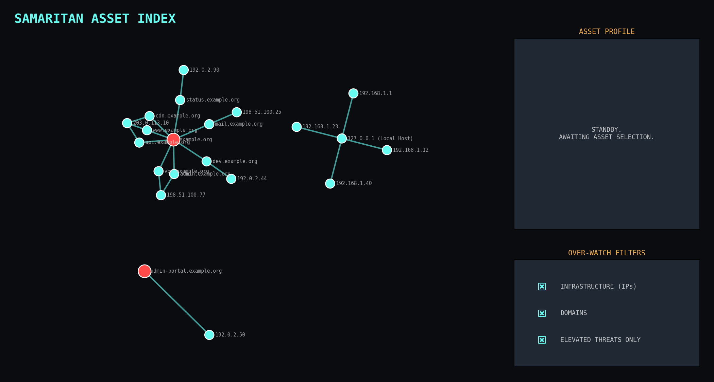

# Samaritan Asset Index — Python Edition

A reconnaissance asset-mapping tool rebuilt as a **pure-Python scientific-computing project** for the
*Python for Scientific Computing (PSC)* course. The original Node.js / React / Neo4j stack
(`RoG7eR/samairitan`) is replaced by NetworkX, NumPy, pandas, SciPy and Matplotlib, and a graph-analytics
layer is added.

> **Authorised use only.** The tool queries public Certificate Transparency logs, resolves DNS and reads the
> local ARP cache. Run sweeps only against domains you own or that are in scope of a bug-bounty / audit programme.



## What it does

| Feature | How it works | Python tools |
|---|---|---|
| Outbound OSINT sweep | crt.sh CT logs → unique subdomains → DNS lookup → `OWNS` / `RESOLVES_TO` edges | `requests`, `socket` |
| Proximity scan | parses `arp -a` → `LOCAL_ADJACENCY` edges from a gateway node | `subprocess`, `re`, `ipaddress` |
| Log parser | extracts a domain → IP pair from free-text intelligence | `re` |
| Graph store | idempotent `MERGE` semantics, JSON persistence | `networkx.MultiDiGraph` |
| **Analytics (new)** | degree/PageRank/betweenness, density, components, degree distribution, shared-infrastructure detection, blast radius, Laplacian spectrum | `numpy`, `pandas`, `scipy`, `networkx` |
| Interactive map | force-directed layout, click-to-focus, Over-Watch filters, asset-profile panel | `matplotlib`, `numpy` |
| Export | nodes / edges / metrics as CSV | `pandas` |

## Mapping from the original project

| Original (JS) | Python replacement |
|---|---|
| Neo4j + Cypher (`MERGE`, `MATCH`) | `samaritan/graph_store.py` (`AssetGraph`) |
| `services/osint.js` | `samaritan/osint.py` |
| `services/localScanner.js` | `samaritan/local_scanner.py` |
| `services/parser.js` | `samaritan/parser.py` |
| `routes/network.js` (REST API) | `samaritan/cli.py` (sub-commands) |
| `ingest.js`, `ingest-live.js` | `ingest` and `sweep` commands |
| React `App.jsx` (command bar, filters, profile) | `visualizer.py` widgets + `cli.py` flags |
| D3 force simulation `NetworkMap.jsx` | `nx.spring_layout` + Matplotlib |

## Install & run

```bash
pip install -r requirements.txt

python main.py demo                    # offline demo data (no network needed)
python main.py stats                   # analytics report
python main.py show                    # interactive window (click nodes, toggle filters)
python main.py show --save map.png --focus 203.0.113.10 --no-domains
python main.py export --out export     # nodes.csv, edges.csv, metrics.csv

python main.py sweep example.org --limit 10   # live OSINT sweep (needs internet)
python main.py local-sweep                    # ARP proximity scan
python main.py ingest "Asset discovered: admin.target.com resolving to IP 192.0.2.5"
python main.py reset
```
Graph state is stored in `data/graph.json` (change with `--db path`).

## Method notes

* **Graph model.** Assets are nodes (`type`, `threat_level`); relationships are keyed edges, so inserting the
  same relationship twice is a no-op, exactly like Cypher `MERGE`.
* **Layout.** Fruchterman–Reingold (`spring_layout`) is run *per connected component* and the components are
  tiled on a grid; one global simulation would repel disconnected pieces to infinity.
* **Metrics.** The adjacency matrix **A** is built with NumPy; in/out-degree are column/row sums. PageRank and
  betweenness rank which assets are structural hubs. `shared_infrastructure` groups hostnames by IP with pandas
  `groupby` to expose single points of failure.
* **Laplacian spectrum.** For the Laplacian **L = D − A** of the undirected graph, the multiplicity of the
  eigenvalue 0 equals the number of connected components (verified in the unit tests).

## Tests

```bash
python -m unittest discover -s tests -v
```
19 tests cover the parser, OSINT (with mocked network/DNS), ARP parsing for Linux/Windows output,
`MERGE` idempotence, JSON round-trip, every analytics function and headless rendering.

## Layout
```
main.py                  entry point
samaritan/               models, parser, osint, local_scanner, graph_store, analytics, visualizer, cli, sample_data
tests/test_samaritan.py
docs/                    screenshots
```
